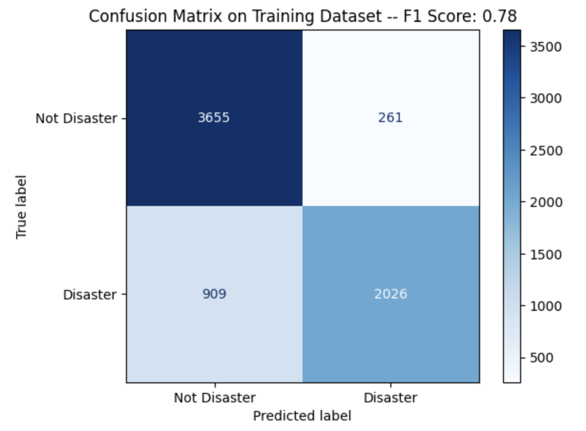

# Fake Disaster Detection

This project is based on the Kaggle Competition: https://www.kaggle.com/competitions/nlp-getting-started/overview

### Info
1. All the data is stored in the sub-folder `data`  
The original data files are train.csv and test.csv.

2. Data cleaning plays an important role in the accuracy of the model performance. The cleaning work is done in the file `common_code.py` - `clean_text` function.

### How to run this project
1. Install other Python packages necessary.
2. open main.ipynb from VSCode or from Colab. (If you choose to run in Colab, copy the whole folder to Google Drive and then mount Google Drive)

## Evaluation
1. Logistic Regression runs well and the accuracy on test set could reach about 79.5% based on the submission result. However, its training set accuracy could reach 85%, as shown in the following confusion matrix. The disparity between training and test set indicates the exiestance of overfitting on the training data.  

  

2. DistilBERT could run pretty well. After transfer training 20 epochs, accuracy on test set could reach 80.2%, while there is not apparent overfitting after 20 epochs transfer training so it is the chosen model. 

  

